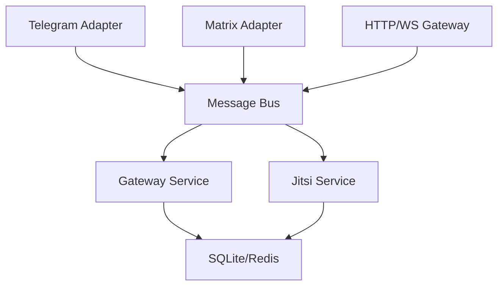

# Matrix-Jitsi-Bot

EVOID-based bot for managing Jitsi meetings via Telegram and Matrix.

## Architecture



## Services

| Service | Port | Description |
|---------|------|-------------|
| **gateway** | 8000 | ASGI gateway + AsyncAPI docs (`/docs`, `/docs/json`) |
| **telebot** | 8001 | Telegram adapter with proxy (socks5/http) support |
| **matrixbot** | 8002 | Matrix/Maubot adapter |
| **jitsi** | 8003 | Core Jitsi logic + SQLite storage |

## Quick Start (Local Dev)

```bash
# Install dependencies
uv sync

# Run ALL services with single command (recommended)
uv run evo run

# Or run services individually
uv run evo service run gateway     # port 8000
uv run evo service run telebot     # port 8001
uv run evo service run matrixbot   # port 8002
uv run evo service run jitsi       # port 8003
```

## Docker Deployment

You can deploy this bot automatically (recommended) or manually.

### 1. One-Command Autopilot Deployment (Quickest)

To fully deploy the entire stack with a single copy-paste command (which clones the repository, checks/installs Docker and Docker Compose, configures environment variables, and launches all services), run:

```bash
git clone https://github.com/EvolveBeyond/Matrix-Jitsi-Bot.git matrix-jitsi-bot && cd matrix-jitsi-bot && chmod +x deploy.sh && ./deploy.sh
```

### 2. Interactive Automatic Deployment

If you have already cloned or copied the repository files locally, run the interactive deployment script:

```bash
chmod +x deploy.sh
./deploy.sh
```

---

### 2. Manual Deployment

#### Prerequisites
- Docker & Docker Compose v2+
- `.env` file with secrets (copy from `.env.example`)

#### Setup

```bash
# 1. Copy and edit environment
cp .env.example .env

# Edit .env with your values:
#   JITSI_DOMAIN=meet.yourdomain.com
#   TELEGRAM_TOKEN=your_bot_token
#   MATRIX_* vars (optional)

# 2. Start Jitsi stack + bots with build
docker compose up -d --build

# 3. Check logs
docker compose logs -f gateway
docker compose logs -f telebot
```

### Services in Docker Compose

```yaml
# Jitsi Server Stack
jitsi-web       # port 8443 (HTTPS), 8000 (HTTP)
jitsi-prosody   # XMPP server
jitsi-jicofo    # Conference focus
jitsi-jvb       # Video bridge (UDP 10000)

# Bot Services
gateway         # port 8000 - HTTP API + AsyncAPI docs
telebot         # Telegram polling (no port exposed)
matrixbot       # Maubot (port 8002)
jitsi           # port 8003 - SQLite storage
```

### Environment Variables

| Variable | Required | Description |
|----------|----------|-------------|
| `JITSI_DOMAIN` | Yes | Your Jitsi domain (e.g., `meet.example.com`) |
| `TELEGRAM_TOKEN` | Yes | Bot token from @BotFather |
| `JICOFO_COMPONENT_SECRET` | Yes | Shared secret for Jicofo |
| `JICOFO_AUTH_PASSWORD` | Yes | Focus user password |
| `JVB_AUTH_PASSWORD` | Yes | JVB user password |
| `JVB_SECRET` | Yes | JVB secret |
| `MATRIX_HOMESERVER` | No | Matrix homeserver URL |
| `MATRIX_USER` | No | Bot Matrix ID (e.g., `@bot:example.com`) |
| `MATRIX_PASSWORD` | No | Matrix password |
| `MATRIX_ACCESS_TOKEN` | No | Matrix access token (alternative to password) |

### Telegram Proxy (Iran)

Configure in `services/telebot/evoid.toml`:

```toml
[engines.proxy]
enabled = true
type = "socks5"    # socks5, socks4, http
host = "127.0.0.1"
port = 2081
# username = ""    # optional
# password = ""    # optional
```

### Health Checks

```bash
# Gateway health
curl http://localhost:8000/health

# AsyncAPI docs
curl http://localhost:8000/docs       # Markdown
curl http://localhost:8000/docs/json  # JSON spec

# Jitsi service health
curl http://localhost:8003/health
```

## SaaS & Multi-Tenant Integration

Matrix-Jitsi-Bot is fully optimized for SaaS and multi-tenant applications to scale and run programmatically:

### 1. Programmatic Non-Interactive Deployment

For automated SaaS deployment pipelines (CI/CD, Terraform, Ansible, or custom scripts), you can bypass the interactive setup of `deploy.sh` completely by passing a pre-configured `.env` file and launching Docker Compose directly:

```bash
# Set your environment variables programmatically
cat <<EOF > .env
JITSI_DOMAIN=meet.yourdomain.com
TELEGRAM_TOKEN=your_tenant_telegram_token
JICOFO_COMPONENT_SECRET=custom_secret
JICOFO_AUTH_PASSWORD=focus_password
JVB_AUTH_PASSWORD=jvb_password
JVB_SECRET=jvb_secret
EOF

# Launch the services in non-interactive/detached mode
docker compose up -d --build
```

### 2. Multi-Tenant Deployments (Run Multiple Bot Instances)

To host multiple independent bot instances for different customers/tenants on the same physical server, use the Docker Compose **Project Name** (`-p`) flag. This isolates the containers, networks, and volumes for each tenant:

```bash
# Start Tenant A
docker compose -p tenant-a up -d --build

# Start Tenant B (with override ports/env)
JITSI_DOMAIN=tenant-b.yourdomain.com TELEGRAM_TOKEN=token_b docker compose -p tenant-b up -d --build
```

### 3. API Integration & Automation

Your SaaS core platform can communicate programmatically with the bot gateway and services via standard REST/WebSocket endpoints:

- **ASGI Gateway API:** Exposed on port `8000` by default. Offers AsyncAPI docs at `http://localhost:8000/docs` or raw JSON at `http://localhost:8000/docs/json`.
- **Health Monitoring:** Integrate with your orchestrator or monitoring stack (e.g., Prometheus, Uptime Kuma) using standard HTTP GET requests:
  - Gateway: `http://localhost:8000/health`
  - Jitsi Bot Service: `http://localhost:8003/health`

---

## Configuration

Each service has its own `evoid.toml`:

```
services/
├── gateway/evoid.toml      # ASGI config, Jitsi URL, rate limits
├── telebot/evoid.toml      # Telegram token, proxy, admin whitelist
├── matrixbot/evoid.toml    # Matrix config, SQLite path, Maubot settings
└── jitsi/evoid.toml        # SQLite DB path, Jitsi URL, rate limits
```

## Telegram Commands

```
/create [name]     - Create meeting
/join <room>       - Join meeting
/hangup            - End call
/watch <url> [name] - Watch party
/stopwatch         - Stop watch party
/mute              - Toggle audio
/video             - Toggle video
/screen            - Toggle screen share
/kick <id>         - Kick participant (admin)
/mod <id>          - Grant moderator (admin)
/record <mode>     - Start recording (admin)
/stoprecord <mode> - Stop recording (admin)
```

## Matrix Commands

```
!jitsi create [name]    - Create meeting
!jitsi join <room>      - Join meeting
!jitsi watch <url> [name] - Watch party
!jitsi mute             - Toggle audio
!jitsi video            - Toggle video
!jitsi kick <id>        - Kick (mod only)
!jitsi mod <id>         - Grant moderator (mod only)
```

## Development

```bash
# Run tests
uv run pytest tests/ -v

# Lint
uv run ruff check .

# Format
uv run ruff check --fix .

# Add new plugin
evo plug install <plugin-name>

# Generate new service
evo service new <name> <port>
```

## Project Structure

```
matrix-jitsi-bot/
├── docker-compose.yml          # Full stack
├── .env.example                # Environment template
├── pyproject.toml              # Python project (uv)
├── jitsi/                      # Jitsi config
├── services/
│   ├── gateway/                # ASGI + AsyncAPI
│   ├── telebot/                # Telegram adapter
│   ├── matrixbot/              # Maubot adapter
│   └── jitsi/                  # Core logic + SQLite
└── shared/
    ├── __init__.py             # Frozen dataclasses
    └── processors/             # validate, authorize, audit, protect
```

## License

Apache-2.0